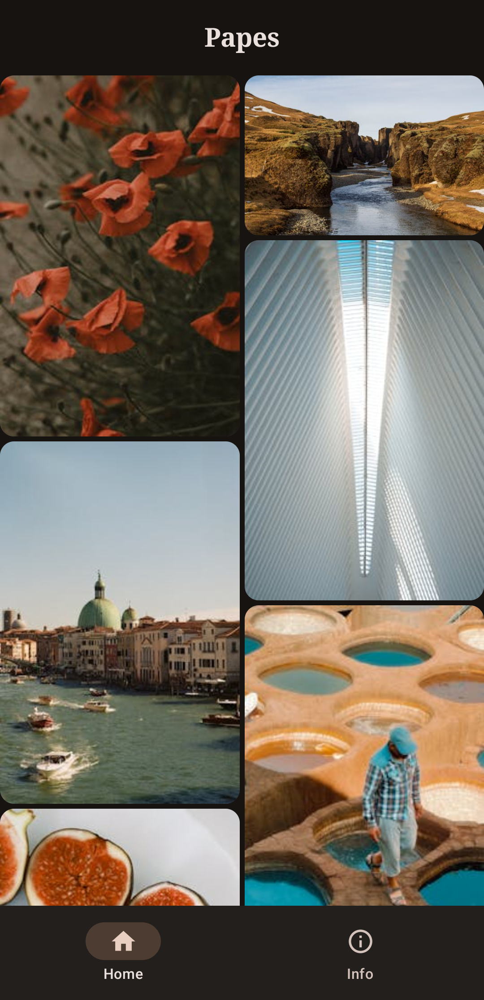
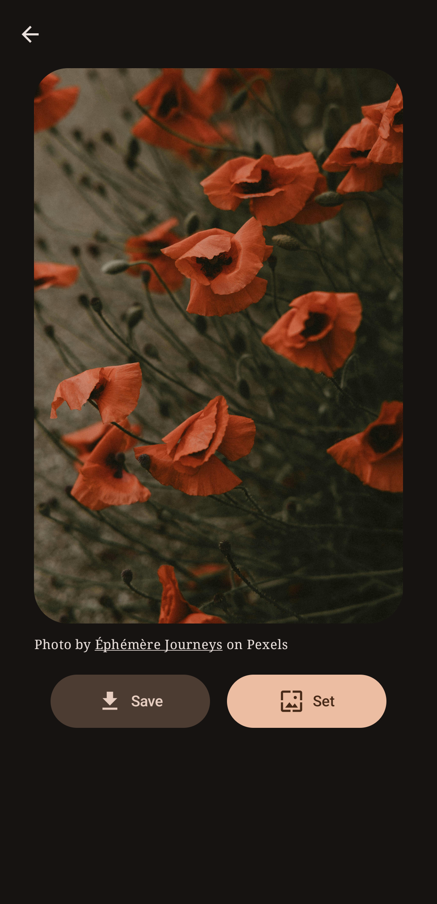
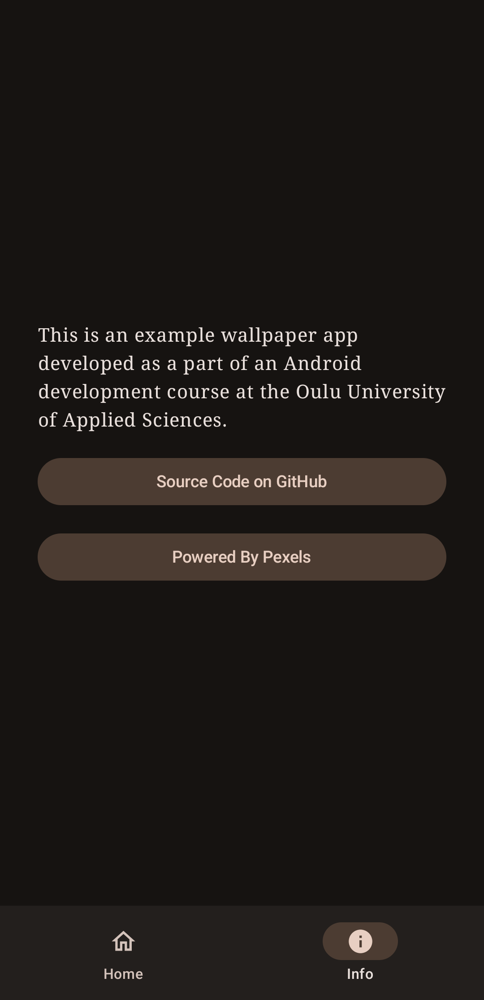

# Papes
A native Android app for wallpapers. Developed as part of a native Android
development course at the Oulu University of Applied Sciences.

The app is written in Kotlin and follows the MVVM architecture pattern with some
clean architecture principles applied.

It uses the [Pexels](https://www.pexels.com) API to fetch images.

## Showcase
<div align="middle">
  
  
  
</div>

## Building
Building the app requires an API key from Pexels. You can get one by signing up at https://www.pexels.com/api/.

 Once you have the key, create a file
`apikey.properties` in the root directory of the project and add the following
line to it:
```
PEXELS_API_KEY="your_api_key_here"
```

## References
I used the following resources to keep up with the latest Android development practices:

- [Google's Now in Android reference app](https://developer.android.com/series/now-in-android)
- [Philipp Lackner's YouTube channel](https://www.youtube.com/PhilippLackner)
- [Guide to app architecture](https://developer.android.com/topic/architecture)
